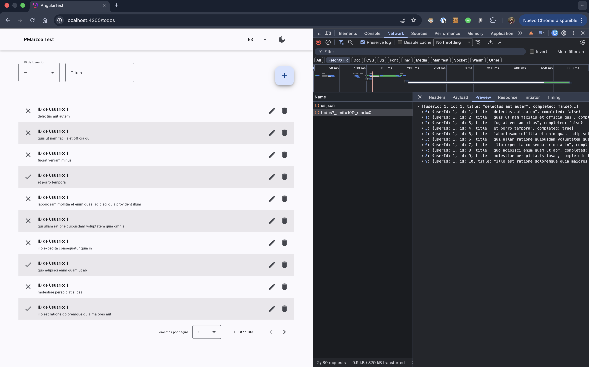
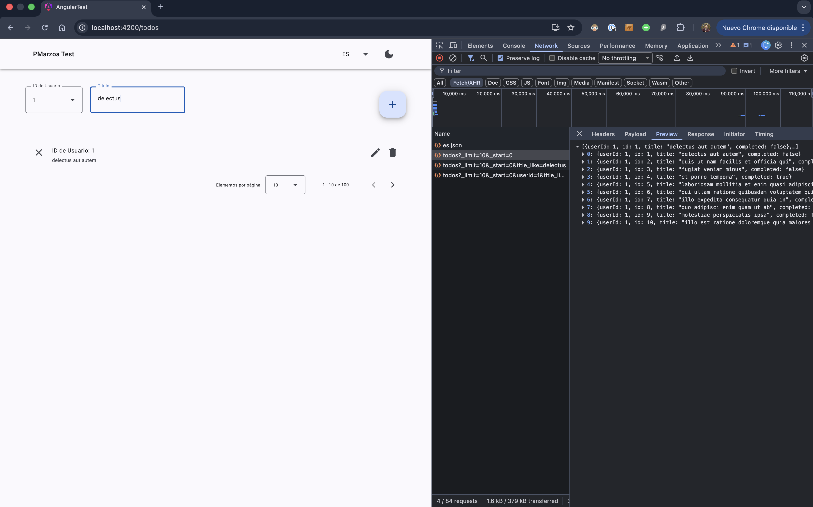
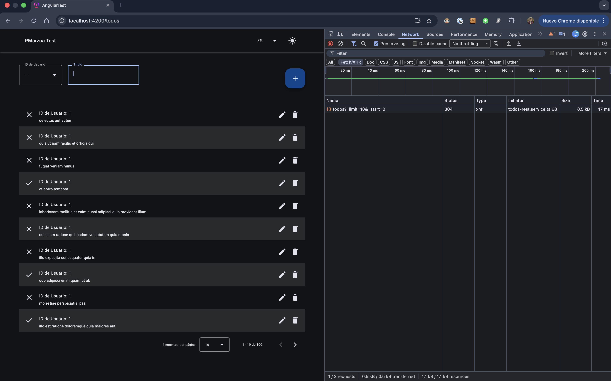
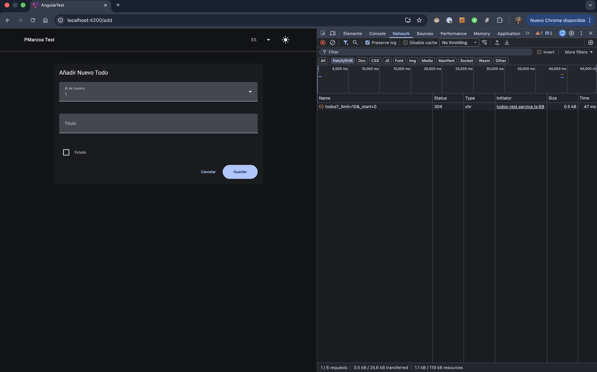
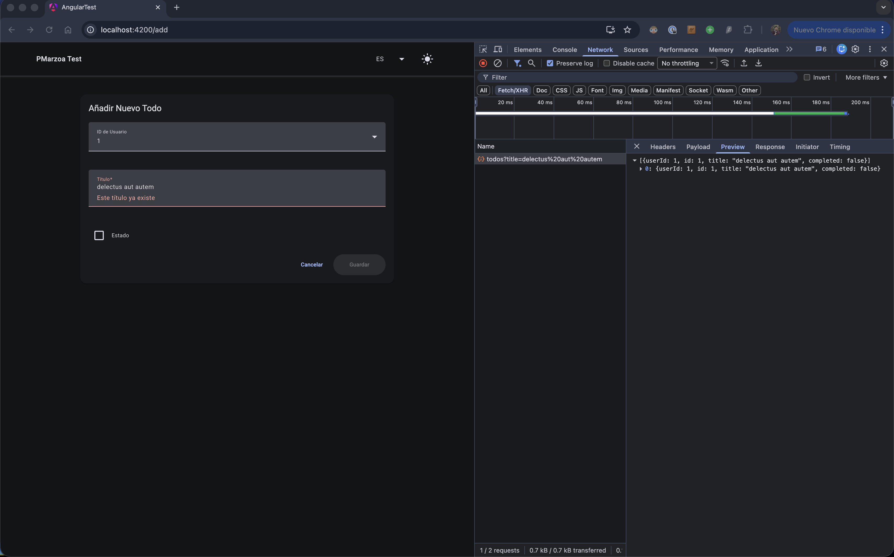
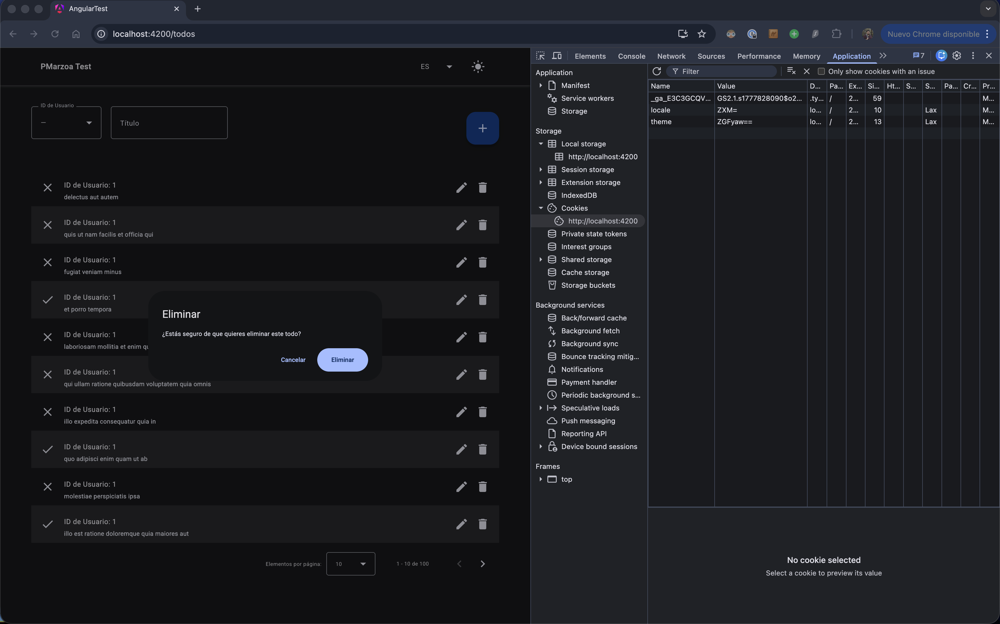
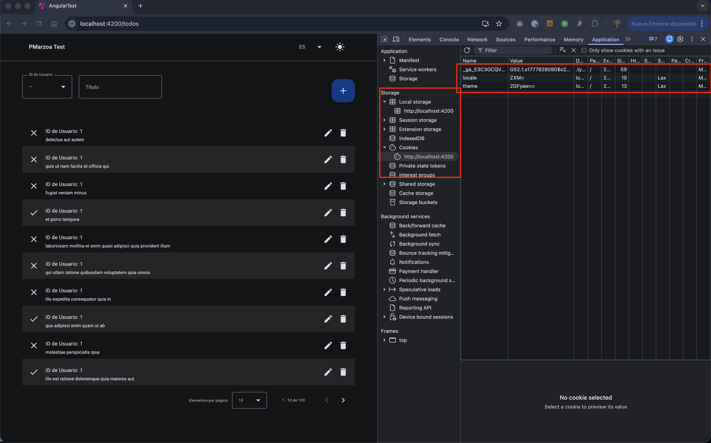
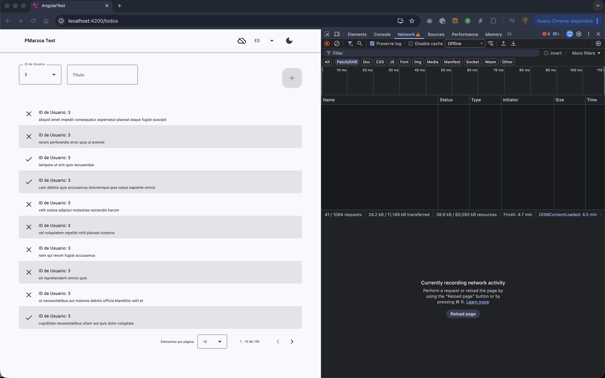

# Angular Todo Management System

  

A robust, modern and responsive Todo Management application built with Angular 21, leveraging the latest features like Signals, standalone components, and advanced reactive patterns.

  

## 🚀 Installation and Execution

  

### Prerequisites

- Node.js (Latest LTS recommended)

- npm (v10+)

  

### Setup

1. Clone the repository:

```bash

git clone https://github.com/PabloMarzoa/angular-test.git

cd angular-test

```

  

2. Install dependencies:

```bash

npm install

```

  

3. Start the development server:

```bash

npm run start

```

The app will be available at `http://localhost:4200`.

  

### Other Commands

- **Linting**: `npm run lint` (ESLint + Prettier check)

- **Formatting**: `npm run format` (Prettier)

- **Testing**: `npm run test` (Vitest)

- **Coverage**: `npm run test:coverage` (Vitest coverage report)

  

---

  

## 🏗️ Architecture

  

The project follows a modular and scalable architecture based on **Angular Best Practices**:

  

- **Views**: High-level page components (Dashboard, Add, Edit) located in `src/views`.

- **Components**: Reusable UI elements (Filter, Header, ConfirmDialog) in `src/components`.

- **Shared**: Code available to any part of the application, grouped by functionality (translations, REST services, theme configuration, models, etc.)

  

---

  

## 🛠️ Technical Decisions

  

### 1. Signal-Based Forms

We opted for the newer `@angular/forms/signals` approach to ensure fine-grained reactivity and seamless integration with the application's overall signal-based state. This allows for cleaner code and better performance compared to traditional Reactive Forms.

  

### 2. Dual-Layer Persistence (`StorageService`)

- **Cookies**: Used for user preferences like `theme` and `locale` to ensure they are available even across different subdomains or early in the request lifecycle.

- **LocalStorage**: Used for UI state like `filters` and `pagination` to maintain the user's view context.

- **Security**: All data is **Base64 encoded** before storage to provide a basic layer of obfuscation and privacy for user data.

  

### 3. Global Error Interceptor

Instead of handling errors in every component, a global `ErrorInterceptor` catches HTTP failures. It displays a user-friendly modal with "Retry" and "Cancel" options, centralizing error UX and reducing boilerplate.

  

### 4. Internationalization (i18n)

A custom `TranslationService` was implemented using JSON assets. This avoids heavy external dependencies while providing a reactive way to switch languages without page reloads.

  

### 5. Vitest over Karma/Jasmine

We use **Vitest** for a significantly faster testing experience and better integration with modern tooling. The project maintains a **>80% code coverage** threshold to ensure reliability.

  

We use **Husky** to validate the code before committing it. This allows us to catch errors early and provide user feedback.

### 7. Progressive Web App (PWA)
The application is fully PWA-ready. It includes a Service Worker that:
- Caches application assets (JS, CSS, HTML, Icons) for instant loading.
- Caches i18n translation files.
- Caches API responses from JSONPlaceholder using a `freshness` strategy, allowing the user to view data even when offline.
- Detects connectivity status and restricts data-mutating actions (Add, Edit, Delete) until connection is restored.

---

  

## 📸 Screenshots

1. **Dashboard View**
   
   Main list showing todos, filters, and pagination.

2. **Dashboard with Filter**
   
   Dynamic filtering by User ID and Title.

3. **Dark Mode**
   
   Full dark mode support for a premium visual experience.

4. **Add Todo Form**
   
   Interface for creating new todos.

5. **Edit with Validation**
   
   Custom validators in action, including duplicate title check via API.

6. **Delete Confirmation**
   
   Safety confirmation modal before deleting an item.

7. **Persistent Storage**
   
   Encoded persistence for settings and preferences in Cookies and LocalStorage.

8. **PWA Service Worker**
   
   Service Worker caching for offline support.

---